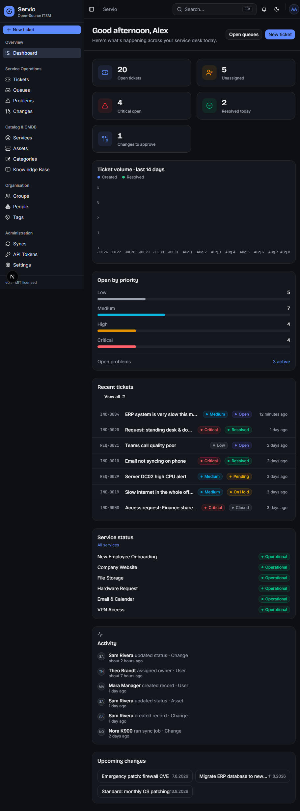

# Servio — Open-Source ITSM

A modern, open-source **IT Service Management** platform — a fresh alternative to GLPI.
Built with **Next.js 16**, **React 19**, **shadcn/ui** (Tailwind v4), **Prisma**, and **Auth.js v5**.

Tickets · Problems · Changes · Queues · Groups · Services · Categories · Assets (CMDB) ·
Infrastructure Syncs · Self-Service Portal · SSO · and a clean public REST API.



## ✨ Features

- **Service desk** — incidents & requests with priorities, impact/urgency, SLAs, queues,
  inline-editable properties, threaded activity with internal notes.
- **Problem management** — root-cause & known-error tracking, linked incidents.
- **Change management** — normal/standard/emergency changes with an approval workflow,
  implementation & rollback plans, affected CIs.
- **CMDB / Assets** — typed configuration items with a **dependency graph**
  (depends-on / runs-on / connects-to …) and linked tickets.
- **Service catalog** with live status (operational / degraded / outage) and SLAs.
- **Organisation** — groups & teams, people/roles, categories (tree), tags.
- **Infrastructure Syncs** — pluggable connectors (Active Directory, Azure AD / Entra,
  Intune, CSV, ServiceNow, GLPI import, REST) with run history and manual/scheduled runs.
- **Self-Service Portal** — a clean end-user help center: submit requests, track tickets,
  browse the service catalog and knowledge base.
- **SSO** — OIDC/SSO (Keycloak, Authentik, Azure AD, Okta, Google…) plus email/password.
- **RBAC** — Admin / Manager / Agent / User, enforced in middleware and server actions.
- **Public REST API** — versioned `/api/v1`, Bearer-token auth with scopes, pagination,
  filtering, and an OpenAPI document.
- **Beautiful by default** — a quiet "control-room" dark/light theme, command palette (⌘K),
  responsive layout, and designed empty/loading states.

## 🧱 Tech stack

| Layer      | Choice |
|------------|--------|
| Framework  | Next.js 16 (App Router, React 19, Turbopack) |
| UI         | shadcn/ui (base-nova) + Tailwind v4, lucide icons, Recharts |
| Data       | Prisma ORM — SQLite (dev) / Postgres (prod) |
| Auth       | Auth.js v5 (Credentials + OIDC), JWT sessions |
| Validation | Zod (shared by server actions and the REST API) |

## 🚀 Getting started

```bash
pnpm install
cp .env.example .env          # then set AUTH_SECRET (npx auth secret)
pnpm db:migrate               # create the SQLite schema
pnpm db:seed                  # rich demo data
pnpm dev                      # http://localhost:3000
```

**Demo login:** `admin@servio.dev` / `servio123`
(Also try an end-user like `liam@servio.dev` to see the self-service portal.)

### Scripts

| Script | Description |
|--------|-------------|
| `pnpm dev` | Start the dev server (Turbopack) |
| `pnpm build` / `pnpm start` | Production build & serve |
| `pnpm db:migrate` | Run Prisma migrations |
| `pnpm db:seed` | Seed demo data |
| `pnpm db:reset` | Reset DB + reseed |
| `pnpm db:studio` | Open Prisma Studio |

## 🔐 SSO / OIDC

Set these in `.env` to enable the "Continue with SSO" button (works with any OIDC provider):

```
AUTH_OIDC_ID="…"
AUTH_OIDC_SECRET="…"
AUTH_OIDC_ISSUER="https://your-idp/realms/main"
AUTH_OIDC_NAME="Company SSO"
```

## 🔌 REST API

Authenticate with a Bearer token (create one under **Settings › API Tokens**):

```bash
curl http://localhost:3000/api/v1/tickets?status=open \
  -H "Authorization: Bearer <token>"
```

- `GET/POST /api/v1/tickets`, `GET/PATCH /api/v1/tickets/{id}`
- `GET/POST /api/v1/assets`, `GET/PATCH /api/v1/assets/{id}`
- `GET /api/v1/services`
- `GET /api/v1/openapi` — OpenAPI 3.1 spec

Demo token (seeded): `servio_demo_pat_0123456789abcdef`

## 🏗️ Architecture

```
app/
  (console)/        Agent console — dashboard + every module (route group)
  portal/           Self-service portal for end users
  login/            Auth pages
  api/v1/           Public REST API (token auth)
components/         Shared UI + shadcn/ui primitives
lib/                db, auth/session, constants (enums), actions, api helpers
prisma/             schema.prisma + seed
docs/               Design blueprint & module playbook
```

- **Server Actions** power the app's own mutations; **Route Handlers** serve the outside world.
- All "enum" fields are `String` columns backed by typed constants in `lib/constants.ts`
  (SQLite-friendly, Zod-validated) — flip the datasource to Postgres without schema changes.

## 🗄️ Going to production

Swap the datasource in `prisma/schema.prisma` to `postgresql`, point `DATABASE_URL` at your
Postgres instance, set a strong `AUTH_SECRET`, then `pnpm build && pnpm start`.

## 📄 License

MIT.
